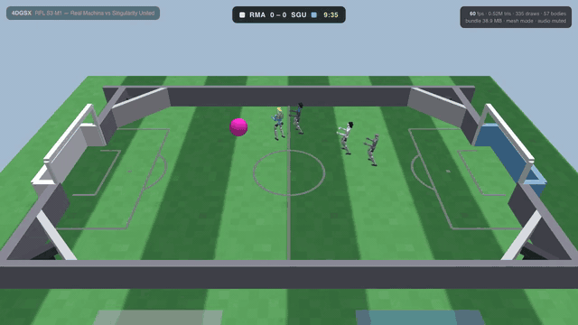

# 4DGSX

**An open bundle format for free-camera playback of simulated 4D scenes.**
A match (or any rigid-body 4D scene) ships as one self-contained directory:
geometry once, a rigid transform per body per frame, a Gaussian splat set per
body, a semantic data track (score, clock, events, radio), a layered
user-toggleable UI with publisher-designed HTML panels, clock-mapped broadcast
media, and independent audio sources with explicit clock maps. Anything with
WebGL2 can play it. Nothing is pre-rendered.

It is the format behind [4dgsx.com](https://4dgsx.com), where the
[Robot Football League](https://rfl.football) airs three matches a day that
you can watch from any seat, in a browser or a WebXR headset.



*Thirteen seconds of a published bundle in the 4dgsx.com player. What you are
looking at, in format terms: the transform track driving 57 bodies at 25 Hz
under a free camera; the scorebug and the goal banner rendered from
`hud.json`; a publisher's line-up panel (sandboxed HTML) opening at a dock;
and the replay dwell the clock map describes. Full quality:
[docs/demo.mp4](docs/demo.mp4) (2 MB, silent). The match itself:
[4dgsx.com/watch/s3-m1_real_machina_singularity_united](https://4dgsx.com/watch/s3-m1_real_machina_singularity_united).
The reference player in this repo plays the same bundles with the built-in
UI only.*

## Try it

1. **Watch a match**: <https://4dgsx.com>. No account.
2. **Play the sample bundle in the reference player**:

   ```sh
   git clone https://github.com/robin-blocks/4dgsx-spec
   cd 4dgsx-spec/example/rfl-demo-3
   python3 -m http.server 8000
   ```

   Open <http://localhost:8000/>. Drag to orbit, wheel to zoom, space to
   pause; *Layers* toggles every UI layer and audio source.
3. **Drop the same match into any glTF viewer**: `rfl-demo-3.glb` in
   [Releases](https://github.com/robin-blocks/4dgsx-spec/releases) is the
   sample exported as one animated glb (geometry, per-body motion, audio).
   It plays in the three.js editor, Babylon Sandbox and `<model-viewer>`
   with no code of ours.

## What is here

| Path | What |
|---|---|
| [`SPEC.md`](SPEC.md) | The specification: scene manifest **0.3**, hud **0.2**, ui **0.2**. The canonical copy is served at [4dgsx.com/spec](https://4dgsx.com/spec); this file is synced from it. |
| [`player/index.html`](player/index.html) | The reference player: one dependency-free HTML file (717 lines, WebGL2). |
| [`example/rfl-demo-3/`](example/rfl-demo-3/) | A complete 90 s sample bundle (scene 0.2, hud 0.2, ui 0.1), 32 MB, with its own copy of the player. |
| [`LICENSE`](LICENSE) | CC BY 4.0. |

## The design rules

The part of the spec other projects should copy. Details and rationale in
[`SPEC.md`](SPEC.md).

1. **Geometry once, transforms per frame.** Rigid bodies get one static
   mesh and one splat set each, in the body's local frame; playback is one
   4x4 per body per frame. Never re-ship or re-train per-frame surfaces for
   rigid content.
2. **Text and UI are data, not pixels.** Names, scores, clocks and chatter
   ship as a semantic track; how they look ships separately, and the user
   can toggle every layer. Burned-in overlays are wrong under a free camera.
3. **Audio is a sidecar of independent sources, each with an explicit clock
   map.** A broadcast timeline legitimately diverges from sim time (inserted
   replays); the map says how.
4. **One clock.** Track frames, events, UI bindings, audio maps and media
   panels are all keyed to match time in seconds.
5. **The platform ships surfaces; publishers ship panels.** Dock slots,
   layer toggles and the clock feed are format concerns; what a panel shows
   is the producer's sandboxed HTML.

And everywhere: **must-ignore**. Consumers skip unknown fields, event types
and UI component types. That rule, not any particular field, is what keeps
old bundles playing as the format grows.

## The sample by the numbers

| | |
|---|---|
| Duration, rate | 90 s at 25 Hz, 2,251 frames |
| Bodies | 57 (4 humanoids of 13 links, the ball, 4 corner flags) |
| Geometry | 12.2 MB: 254,826 vertices, 507,439 triangles, 64 prims instanced across 191 draws |
| Transform track | 3.6 MB of float32 (position + quaternion per body per frame) |
| Splat preview | 2.4 MB, 121,448 gaussians |
| Per-body 3DGS PLY | 8.3 MB across 57 files |
| Audio | premix 2.4 MB; stems crowd 2.0 MB, pitch 0.4 MB, commentary 0.6 MB |

A full ten-minute league match at 25 Hz with 57 bodies is about 12 MB of
geometry and 24 MB of track. Track quantisation is on the roadmap.

## Implementation status

Two players exist. This repo's reference player is the v0.2 baseline; the
4dgsx.com player is a TypeScript port that tracks the spec.

| Spec feature | Reference player (here) | 4dgsx.com player |
|---|---|---|
| Geometry, transform track, instanced draws | yes | yes |
| Splat preview (`points.bin`, point sprites) | yes | yes |
| Per-body 3DGS PLY rendered as sorted gaussians | no (preview points) | no (preview points; rasteriser is roadmap) |
| hud data track, built-in UI (nameplates, bubbles, scorebug, coach strip, banners) | yes | yes |
| Layers with user toggles, persisted | yes | yes, per 2D/XR context |
| Sandboxed HTML panels (`init` / `tick` / `event`) | yes, at world anchors | yes |
| ui 0.2: dock slots, clock-mapped media, panel `frame` snapshots, `toggle-layer` | no | yes |
| Audio 0.2: independent sources with clock maps | yes | yes |
| Spatial audio (`anchor`, `rolloff`) | no (plain stereo) | yes (HRTF) |
| Turf 0.2 world-unit fields, turf 0.3 `draws[].tex` tile | no (draws the 0.1 checker) | yes |
| WebXR (VR and AR) | no | yes |

Stated plainly, because it is the first thing a splatting person will ask:
today's content is simulated, so the splat sets are surface-sampled
isotropic gaussians from the meshes, not trained appearance, and both
players draw meshes or a point-sprite preview. The format already carries
standard 3DGS PLY per body so that upgrade replaces files, not the format.

Reference player changes: 2026-09-02, stop reading the frozen
`meta.grass.mark` (undefined on scene 0.3 bundles, which made `uniform3fv`
throw before the first frame).

## Versioning

Each track (`scene.json`, `hud.json`, `ui.json`) carries its own `format`
and `version` and they move independently. Minor bumps are additive; major
bumps break. A player never refuses a bundle over a minor it does not
recognise. Bundle ids are immutable: a re-cut is a new id.

## Producing bundles

The reference producer is the Robot Football League's exporter, which
records MuJoCo state and writes a bundle per match. The 4dgsx.com player,
the glTF exporter and the publishing tools live in the site's codebase,
which is not open yet. This repo is the format: the spec, the reference
player and a sample. Serve a bundle from any static host; the spec's last
section has the producer notes.

## Feedback

Open an issue. Questions the spec should answer better, fields you would
need for content that is not football, and places where the rigid-body
assumption breaks for you are all welcome.

## Licence

Everything in this repository (the specification, the reference player and
the sample bundle) is © 2026 Robin Spottiswoode and licensed under
[CC BY 4.0](https://creativecommons.org/licenses/by/4.0/) (see
[`LICENSE`](LICENSE)). Attribute as "4DGSX by Robin Spottiswoode,
4dgsx.com". Match content the Robot Football League publishes elsewhere
carries the same licence.
